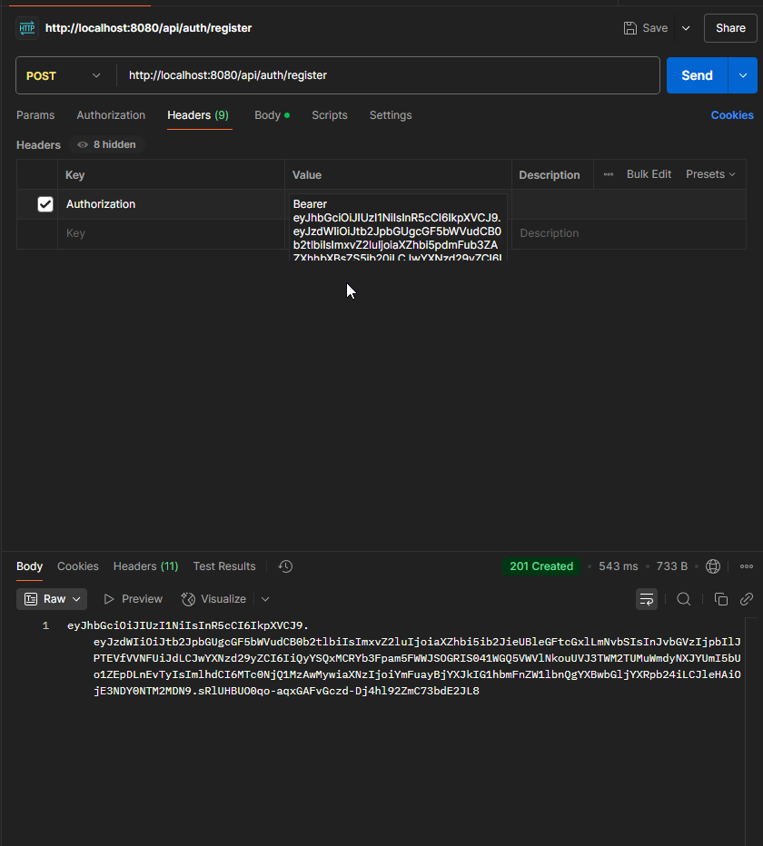
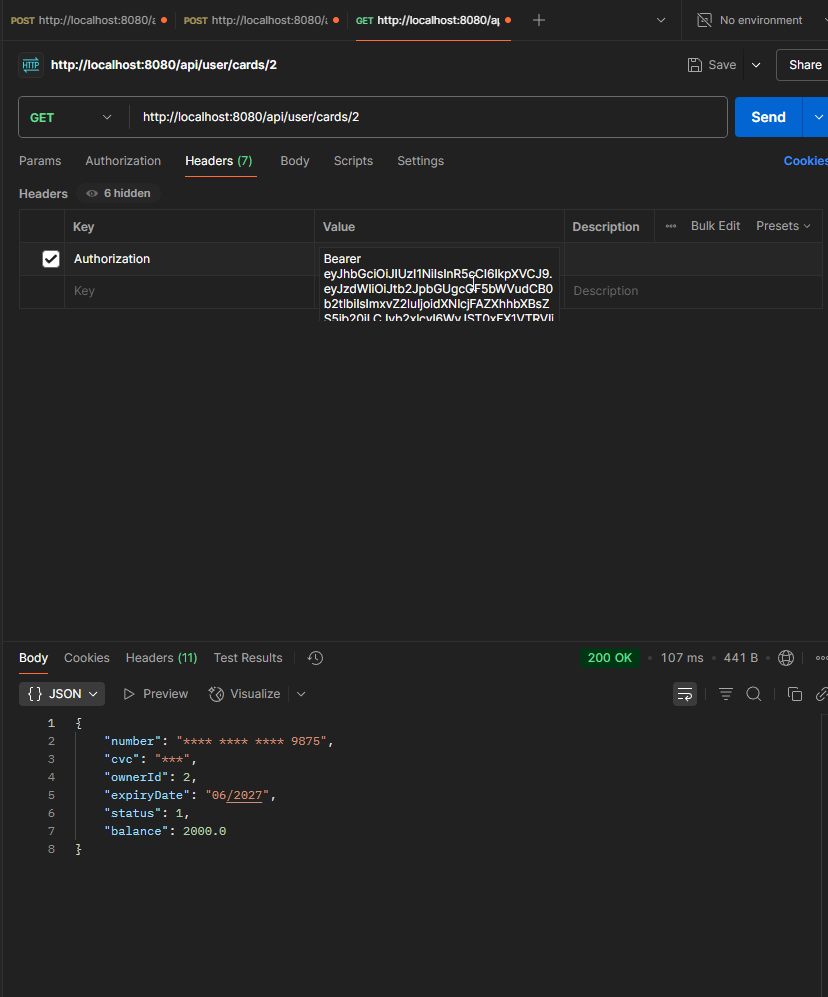
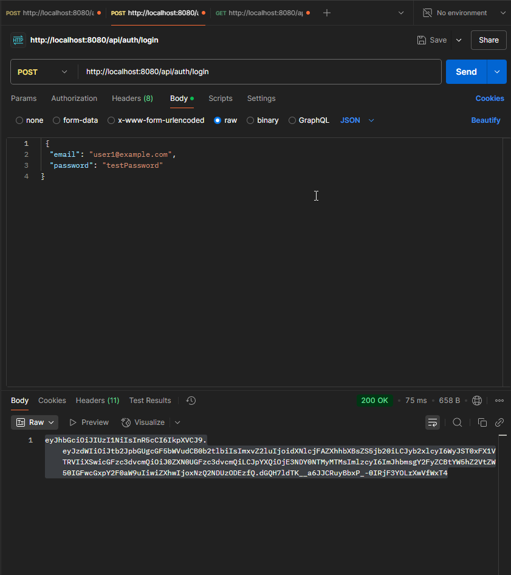
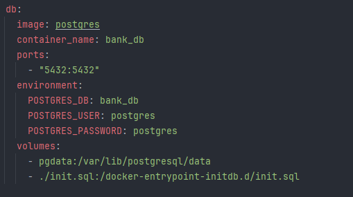
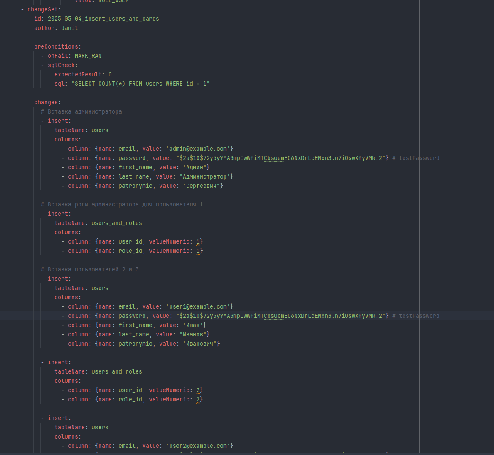

Команды для запуска из под Windows:
1. docker-compose up db (оставляем включенным)
2. mvn clean install "-Dspring.profiles.active=local" (в новом окне терминала параллельно 1-му пункту)
3. стопаем через ctrl + c наш db (первый пункт)
4. docker-compose up --build

Как пользоваться API:

1. Получаем токен при регистрации:

2. Отправляем токен при любом неразрешенном запросе в хедере Authorization с припиской вначале Bearer + пробел:

3. Когда токен "протухнет", то нужно залогиниться для получения нового:

Особенности:
- Базу данных инициализирует Docker подхватывая sql скрипт инициализации при первом запуске.

- Тестовые пользователи и администраторы добавляются миграцией Liquibase, если их нет.

Документация Swagger доступна по URL:
- http://localhost:8080/swagger-ui/index.html

Аккаунт администратора:
- email: admin@example.com
- password: testPassword

Аккаунты пользователей:
- email: user1@example.com
- password: testPassword

- email: user2@example.com
- password: testPassword

ТЗ:
Разработка Системы Управления Банковскими Картами
Описание задачи:
Необходимо разработать backend-часть системы управления банковскими картами с использованием Java и Spring Boot. Система должна обеспечивать создание, управление и просмотр данных о банковских картах, а также выполнение операций между картами пользователя.
Каждая карта должна содержать следующие атрибуты:
* Номер карты (masked, хранится в зашифрованном виде)
* Владелец карты
* Срок действия
* Статус карты (Активна, Заблокирована, Истек срок действия)
* Баланс

Система должна предоставлять REST API для взаимодействия с картами, включая фильтрацию и постраничную выдачу.

Требования:

✅ Аутентификация и авторизация:
* Реализовать аутентификацию по email и паролю с использованием Spring Security и JWT.
* Поддержка ролей: Администратор и Пользователь.

✅ Функциональные возможности:
Администратор может:
* Создавать, блокировать, активировать и удалять карты.
* Просматривать все карты.
* Управлять пользователями.

Пользователь может:
* Просматривать свои карты (с параметризованным поиском и постраничной выдачей).
* Запрашивать блокировку карты.
* Совершать переводы между своими картами, если у него есть несколько карт.
* Просматривать баланс по своим картам.

✅ API:
* Эндпоинты для CRUD-операций над картами.
* Операции перевода средств между картами пользователя.
* Параметризированный поиск и постраничная выдача списка карт.
* Валидация входящих данных.
* Детализированные сообщения об ошибках.

✅ Безопасность:
* Данные карт хранятся в зашифрованном виде.
* Доступ к API ограничен ролями пользователей.
* Маскирование номера карты при отображении (например: **** **** **** 1234)

✅ Работа с БД:
* Использование PostgreSQL или MySQL.
* Настроить миграции базы данных через Liquibase.

✅ Документация:
* API должно быть описано с помощью OpenAPI (Swagger UI).
* README с инструкциями по локальному запуску.

✅ Развертывание и тестирование:
* Использование Docker Compose для dev-среды.
* Liquibase для управления миграциями.
* Юнит-тесты с покрытием ключевых бизнес-функций.

Оценка работы:
- 📌 Соответствие требованиям
- 📌 Чистота и качество кода
- 📌 Безопасность хранения данных
- 📌 Обработка ошибок
- 📌 Проектирование системы (ООП, уровни абстракции)
- 📌 Наличие тестов

💡 Технологии:
Java 17+, Spring Boot, Spring Security, Spring Data JPA(Hibernate), PostgreSQL/MySQL, Liquibase, Docker, OpenAPI (Swagger)

